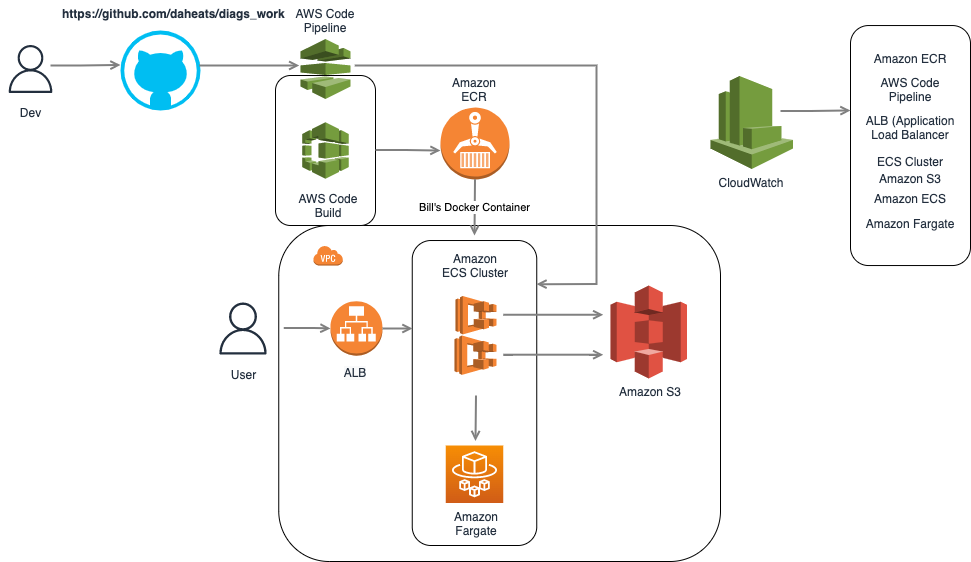

# Diags Take-Home

Encompasses the take-home test items for the Diag Upload Service.

## Architecture

## Design Decisions

- Always use AWS managed resources when you can! It helps offload infrastructure management to make room for more exciting and innovative work. The AWS managed resources in this architecture are AWS Code Pipeline, Amazon ECR, and Amazon ECS.

- Using an application load balancer routes and balances traffic securely to your resources. In this architecture, our resource is the ECS cluster. You can also setup CloudWatch metrics for your application load balancer to monitor the requests flowing through it.

- Fargate takes out the need for us to manage the underlying infrastructure in which ECS containers run on. It can automatically scale an ECS cluster up or down depending on usage. It's extremely cost effective because you only pay for what you use!

- I chose CloudWatch (obviously) to take care of monitoring. With CloudWatch, you can configure and receive CloudWatch Logs, and set up dashboards based on CloudWatch metrics. Using CloudWatch seemed like a no brainer to me for the observability factor in this challenge.

- The CloudWatch dashboard which will house the CloudWatch metrics will reflect the [four golden signals that Google's site reliability engineers use](https://sre.google/sre-book/monitoring-distributed-systems/) - Latency, Traffic, Errors, and Saturation.

## Setup & Instructions for Running & Testing Locally
